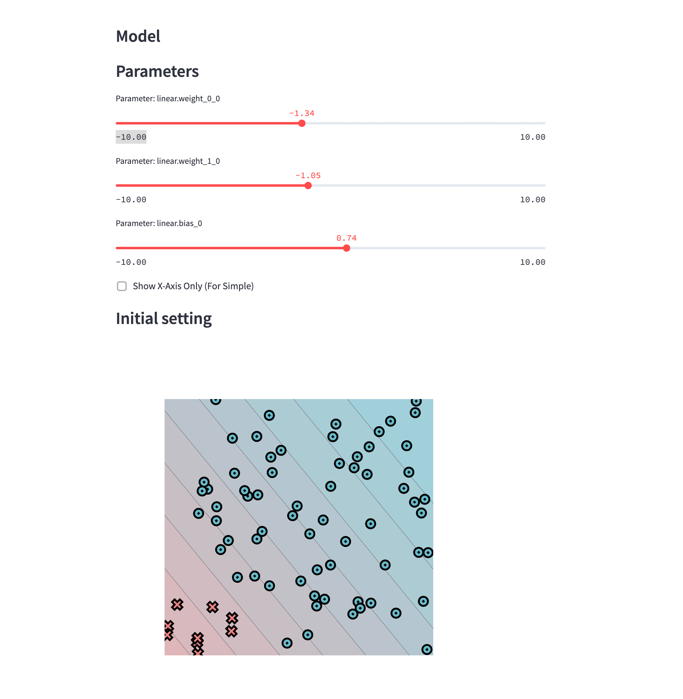

# MiniTorch Module 0

* Docs: https://minitorch.github.io/

* Overview: https://minitorch.github.io/module0.html

* Task 05 Results:

**TODO:** 
- Sigmoid implementation fails at strictly increasing test when input is 37.0: `sigmoid(37.0) == sigmoid(38.) == 1.0`